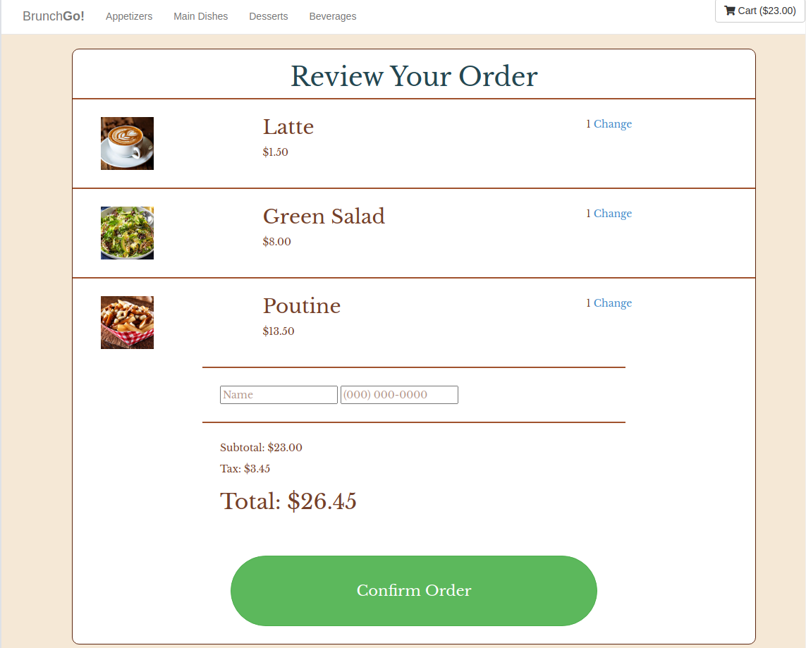
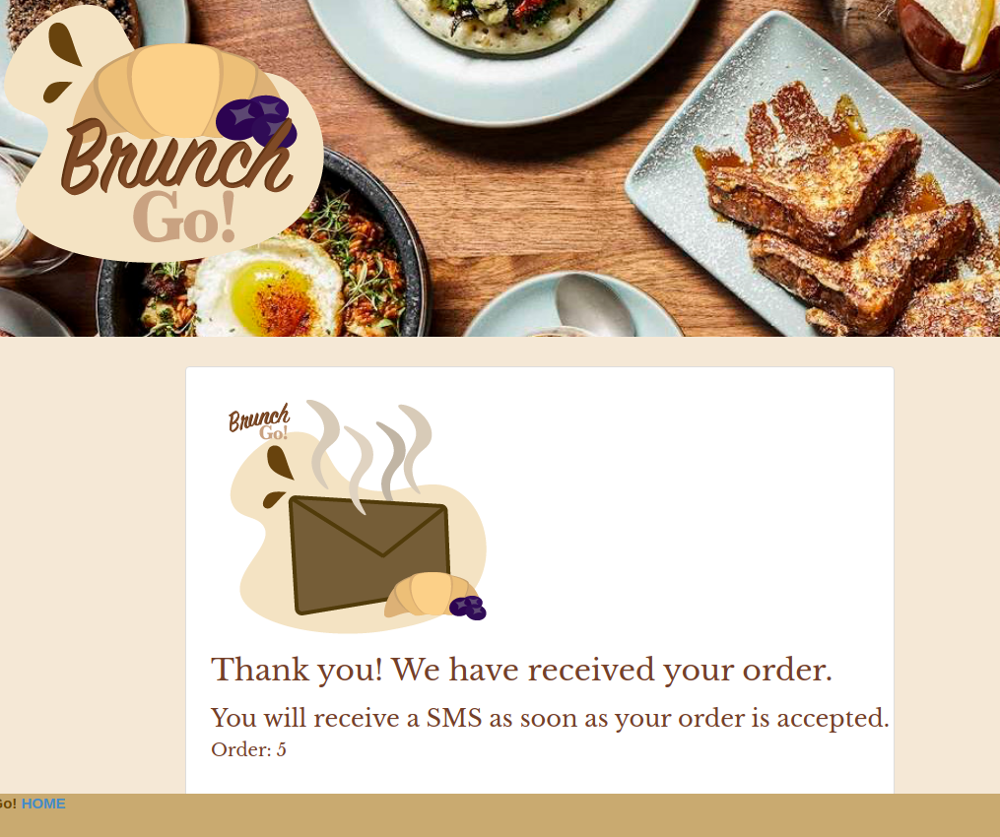
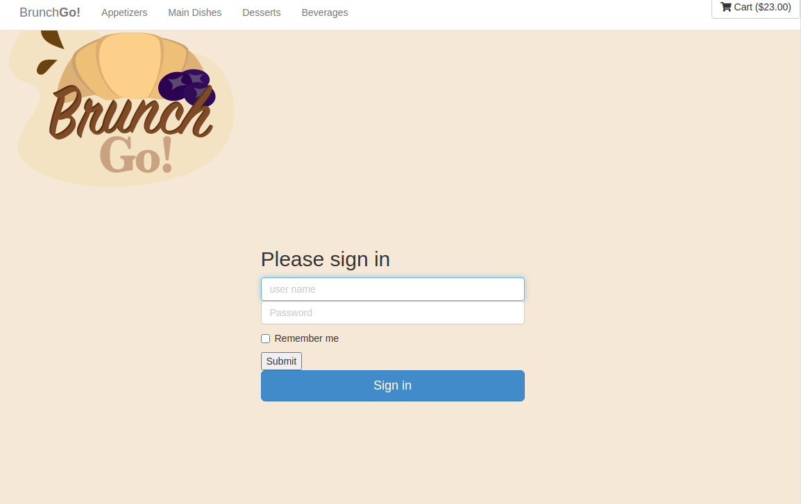
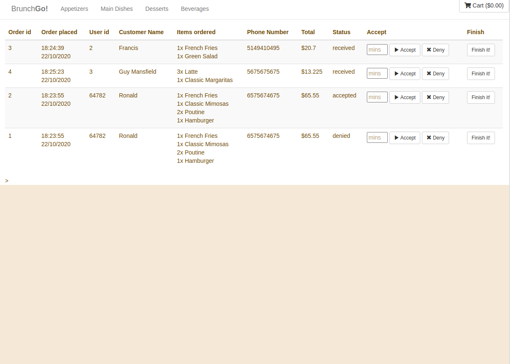

BrunchGo!
=========

## Midterm project:

The present project was build as a partnership by [Amanda Arnaut Alliegro](https://github.com/amandaalliegro), [Erik Leisinger](https://github.com/erikleisinger) and [George Tang](https://github.com/georgecctang/).

BrunchGo! Is a full stack web application for ordering meals from a restaurant for pickup. This app is built with Node, Express and Postresql database. 

### With this app, customers can:
- Browse through the restaurants menu, and select their favourite items

- Order with their name and phone number

- View the status of their orders (received, in-preparation, ready-for-pickup, or  denied)

- Receive an SMS notification for an update in status

### Restaurant owners can:
- Receive an SMS for a new order
- Log in and out of back-end admin tools

- Browse all orders in a page

- Enter an estimated preparation time
- Accept or deny order
- Notify customer with SMS when ready for pickup

## Getting Started

1. Create the `.env` by using `.env.example` as a reference: `cp .env.example .env`
2. Update the .env file with your correct local information 
  DB_HOST=localhost
- DB_USER=labber
- DB_PASS=labber
- DB_NAME=midterm
- #/ Uncomment and set to true for Heroku
- #/ DB_SSL=true if heroku
- DB_PORT=5432
- ACCOUNTSID= 'Twilio Account Sid'
- AUTHTOKEN='Twilio Auth Token'
- OWNERPHONE='Restaurant Phone Number'
3. Install dependencies: `npm i`
4. Fix to binaries for sass: `npm rebuild node-sass`
5. Reset database: `npm run db:reset`
  - Check the db folder to see what gets created and seeded in the SDB
7. Run the server: `npm run local`
  - Note: nodemon is used, so you should not have to restart your server
8. Visit `http://localhost:8080/`

## Dependencies

- bcrypt: "^5.0.0",
- body-parser: "^1.19.0",
- bootstrap: "^3.4.1",
- chalk: "^2.4.2",
- cookie-session: "^1.4.0",
- dotenv: "^2.0.0",
- ejs: "^2.6.2",
- express: "^4.17.1",
- morgan: "^1.9.1",
- node-sass-middleware: "^0.11.0",
- pg: "^6.4.2",
- pg-native: "^3.0.0",
- twilio: "^3.50.0"

